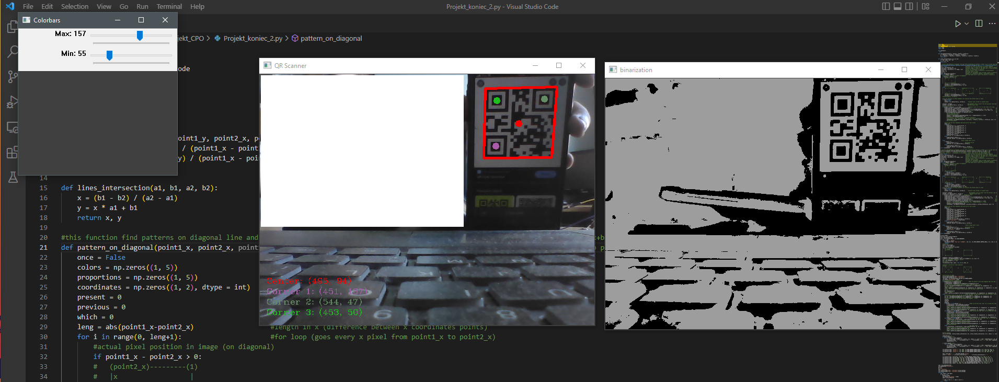

<!-- ABOUT THE PROJECT -->
## About The Project

This is app which detects QR code. It lists the coordinates of the center of QR, and centers of three black squares in the corners. The program is written in python which mainly uses opencv (for image processing) and numpy (for math calculations). 

